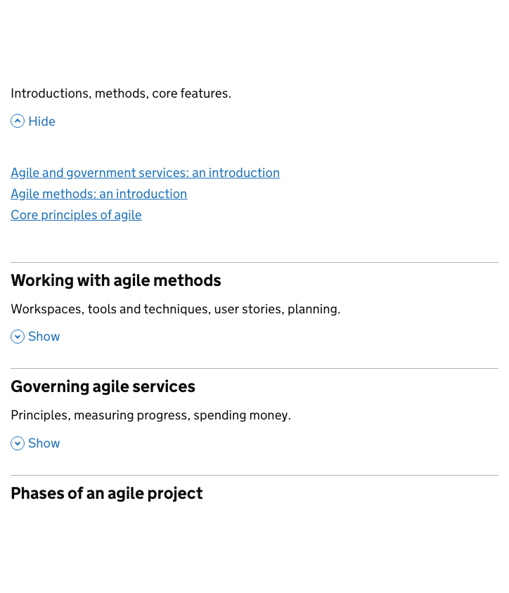

# Accordion

[GDS Accordion component](https://design-system.service.gov.uk/components/accordion/)

## Example

```razor
<govuk-accordion id="accordion-with-summary-sections" heading-level="3">
    <govuk-accordion-item expanded="true">
        <govuk-accordion-item-heading>Understanding agile project management</govuk-accordion-item-heading>
        <govuk-accordion-item-summary>Introductions, methods, core features.</govuk-accordion-item-summary>
        <govuk-accordion-item-content>
            <ul class="govuk-list">
                <li>
                    <a class="govuk-link" href="#">Agile and government services: an introduction</a>
                </li>
                <li>
                    <a class="govuk-link" href="#">Agile methods: an introduction</a>
                </li>
                <li>
                    <a class="govuk-link" href="#">Core principles of agile</a>
                </li>
            </ul>
        </govuk-accordion-item-content>
    </govuk-accordion-item>
    <govuk-accordion-item>
        <govuk-accordion-item-heading>Working with agile methods</govuk-accordion-item-heading>
        <govuk-accordion-item-summary>Workspaces, tools and techniques, user stories, planning.</govuk-accordion-item-summary>
        <govuk-accordion-item-content>
            <ul class="govuk-list">
                <li>
                    <a class="govuk-link" href="#">Creating an agile working environment</a>
                </li>
                <li>
                    <a class="govuk-link" href="#">Agile tools and techniques</a>
                </li>
                <li>
                    <a class="govuk-link" href="#">Set up a team wall</a>
                </li>
                <li>
                    <a class="govuk-link" href="#">Writing user stories</a>
                </li>
                <li>
                    <a class="govuk-link" href="#">Planning in agile</a>
                </li>
                <li>
                    <a class="govuk-link" href="#">Deciding on priorities</a>
                </li>
                <li>
                    <a class="govuk-link" href="#">Developing a roadmap</a>
                </li>
            </ul>
        </govuk-accordion-item-content>
    </govuk-accordion-item>
    <govuk-accordion-item>
        <govuk-accordion-item-heading>Governing agile services</govuk-accordion-item-heading>
        <govuk-accordion-item-summary>Principles, measuring progress, spending money.</govuk-accordion-item-summary>
        <govuk-accordion-item-content>
            <ul class="govuk-list">
                <li>
                    <a class="govuk-link" href="#">Governance principles for agile service delivery</a>
                </li>
                <li>
                    <a class="govuk-link" href="#">Measuring and reporting progress</a>
                </li>
                <li>
                    <a class="govuk-link" href="#">Spend controls: check if you need approval to spend money on a service</a>
                </li>
                <li>
                    <a class="govuk-link" href="#">Spend controls: apply for approval to spend money on a service</a>
                </li>
                <li>
                    <a class="govuk-link" href="#">Spend controls: the new pipeline process</a>
                </li>
                <li>
                    <a class="govuk-link" href="#">Working across organisational boundaries</a>
                </li>
            </ul>
        </govuk-accordion-item-content>
    </govuk-accordion-item>
    <govuk-accordion-item>
        <govuk-accordion-item-heading>Phases of an agile project</govuk-accordion-item-heading>
        <govuk-accordion-item-summary>Discovery, alpha, beta, live and retirement.</govuk-accordion-item-summary>
        <govuk-accordion-item-content>
            <ul class="govuk-list">
                <li>
                    <a class="govuk-link" href="#">How the discovery phase works</a>
                </li>
                <li>
                    <a class="govuk-link" href="#">How the alpha phase works</a>
                </li>
                <li>
                    <a class="govuk-link" href="#">How the beta phase works</a>
                </li>
                <li>
                    <a class="govuk-link" href="#">How the live phase works</a>
                </li>
                <li>
                    <a class="govuk-link" href="#">Retiring your service</a>
                </li>
            </ul>
        </govuk-accordion-item-content>
    </govuk-accordion-item>
</govuk-accordion>
```



## API

### `<govuk-accordion>`

| Attribute | Type | Description |
| --- | --- | --- |
| `id` | `string` | *Required* The `id` attribute for the accordion. Must be unique across the domain of your service. Cannot be `null` or empty. |
| `heading-level` | `int` | The heading level. Must be between `1` and `6` (inclusive). The default is `2`. |
| `remember-expanded` | `bool` | Whether the expanded/collapsed state of the accordion should be saved when a user leaves the page and restored when they return. The default is `true`. |
| `hide-all-sections-text` | `string` | The text content of the 'Hide all sections' button at the top of the accordion when all sections are expanded. |
| `hide-section-text` | `string` | 	The text content of the 'Hide' button within each section of the accordion, which is visible when the section is expanded. |
| `hide-section-aria-label-text` | `string` | The text made available to assistive technologies, like screen-readers, as the final part of the toggle's accessible name when the section is expanded. The defaults is 'Hide this section'. |
| `show-all-sections-text` | `string` | The text content of the 'Show all sections' button at the top of the accordion when at least one section is collapsed. |
| `show-section-text` | `string` | 	The text content of the 'Show' button within each section of the accordion, which is visible when the section is collapsed. |
| `hide-section-aria-label-text` | `string` | The text made available to assistive technologies, like screen-readers, as the final part of the toggle's accessible name when the section is collapsed. The defaults is 'Show this section'. |

### `<govuk-accordion-item>`

Must be inside a `<govuk-accordion>` element.

| Attribute | Type | Description |
| --- | --- | --- |
| `expanded` | `bool` | Whether the section should be expanded upon initial load. The default is `false`. |

### `<govuk-accordion-item-heading>`

The content is the HTML of the header for each section which is used both as the title for each section, and as the button to open or close each section.\
Must be inside a `<govuk-accordion-item>` element.

### `<govuk-accordion-item-summary>`

The content is the HTML for the summary line.\
Must be inside a `<govuk-accordion-item>` element.

### `<govuk-accordion-item-content>`

The content is the HTML of the section, which is hidden when the section is closed.\
Must be inside a `<govuk-accordion-item>` element.
