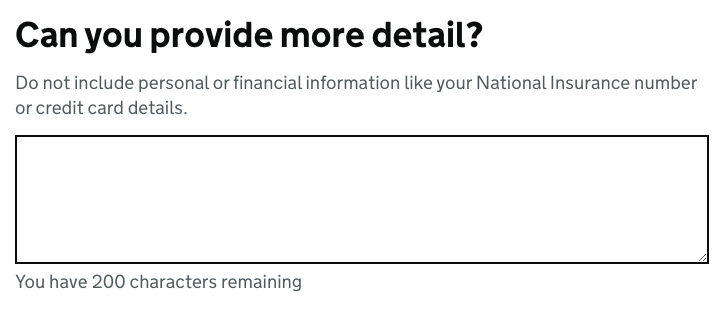

# Character count

[GDS Character count component](https://design-system.service.gov.uk/components/character-count/)

Check out the [max words validator](../validation/maxwords.md) for adding server-side validation when `max-words` is used.

## Example

```razor
<govuk-character-count name="more-detail" max-length="200">
    <govuk-character-count-label class="govuk-label--l" is-page-heading="true">
        Can you provide more detail?
    </govuk-character-count-label>
    <govuk-character-count-hint>
        Do not include personal or financial information like your National Insurance number or credit card details.
    </govuk-character-count-hint>
</govuk-character-count>
```




## API

### `<govuk-character-count>`

| Attribute | Type | Description |
| --- | --- | --- |
| `asp-for` | `ModelExpression` | The model expression used to generate the `name` and `id` attributes, the content as well as the error message content. See [documentation on forms](forms.md) for more information. |
| `autocomplete` | `string` | The `autocomplete` attribute for the generated `textarea` element. |
| `count-message-*` | | Additional attributes to add to the generated count message hint element. |
| `disabled` | `bool` | Whether the textarea should be disabled. The default is `false`. |
| `form-group-*` | | Additional attributes to add to the generated form-group wrapper element. |
| `id` | `string` | The `id` attribute for the generated `textarea` element. If not specified then a value is generated from the `name` attribute. |
| `ignore-modelstate-errors` | `bool` | Whether ModelState errors on the ModelExpression specified by the `asp-for` attribute should be ignored when generating an error message. The default is `false`. |
| `label-class` | `string` | Additional classes for the generated `label` element. |
| `max-length` | `int?` | The maximum number of characters the generated `textarea` may contain. Required unless the `max-words` attribute is specified. |
| `max-words` | `int?` | The maximum number of words the generated `textarea` may contain. Required unless the `max-length` attribute is specified. |
| `name` | `string` | The `name` attribute for the generated `textarea` element. Required unless the `asp-for` attribute is specified. |
| `rows` | `int` | The `rows` attribute for the generated `textarea` element. The default is `5`. |
| `spellcheck` | `bool?` | The `spellcheck` attribute for the generated `textarea` element. The default is `null`. |
| `textarea-*` | | Additional attributes to add to the generated `textarea` element. |
| `threshold` | `int?` | The percentage value of the limit at which point the count message is displayed. If this is specified the count message will be hidden by default. |

### `<govuk-character-count-label>`

*Required*\
The content is the HTML to use within the component's label.\
Must be inside a `<govuk-character-count>` element.

| Attribute | Type | Description |
| --- | --- | --- |
| `is-page-heading` | `bool` | Whether the label also acts as the heading for the page. The default is `false`. |

### `<govuk-character-count-hint>`

The content is the HTML to use within the component's hint.\
Must be inside a `<govuk-character-count>` element.

If the `asp-for` attribute is specified on the parent `<govuk-character-count>` then content for the hint will be generated from the model expression.\
If you want to retain the generated content and specify additional attributes then use a self-closing tag e.g.
`<govuk-character-count-hint class="some-additional-class" />`.

### `<govuk-character-count-error-message>`

The content is the HTML to use within the component's error message.\
Must be inside a `<govuk-character-count>` element.

If the `asp-for` attribute is specified on the parent `<govuk-character-count>` then content for the error message will be generated from the model expression.
(To prevent this set `ignore-modelstate-errors` on the parent `<govuk-character-count>` to `false`.) Specifying any content here will override any generated error message.\
If you want to retain the generated content and specify additional attributes then use a self-closing tag e.g.
`<govuk-character-count-error-message visually-hidden-text="Error" />`.

| Attribute | Type | Description |
| --- | --- | --- |
| `visually-hidden-text` | `string` | The visually hidden prefix used before the error message. The default is `Error`. |

### `<govuk-character-count-value>`

The content is the HTML to use within the generated `textarea`.\
Must be inside a `<govuk-character-count>` element.
